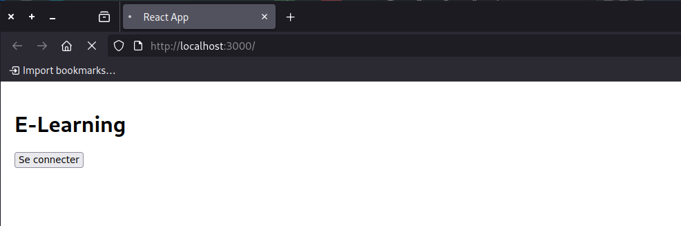
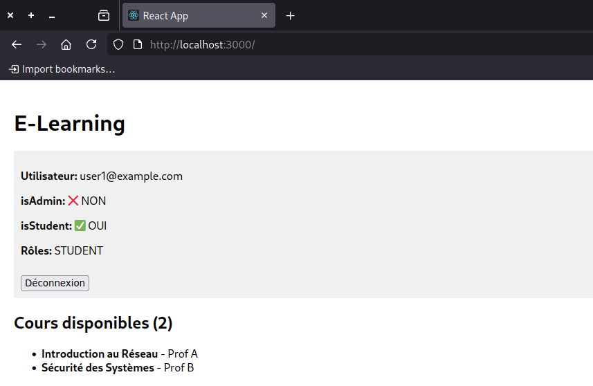
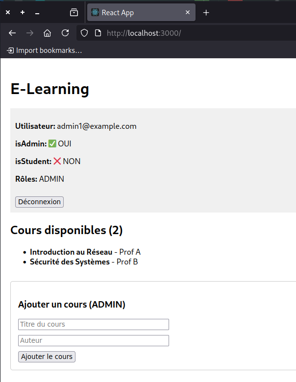
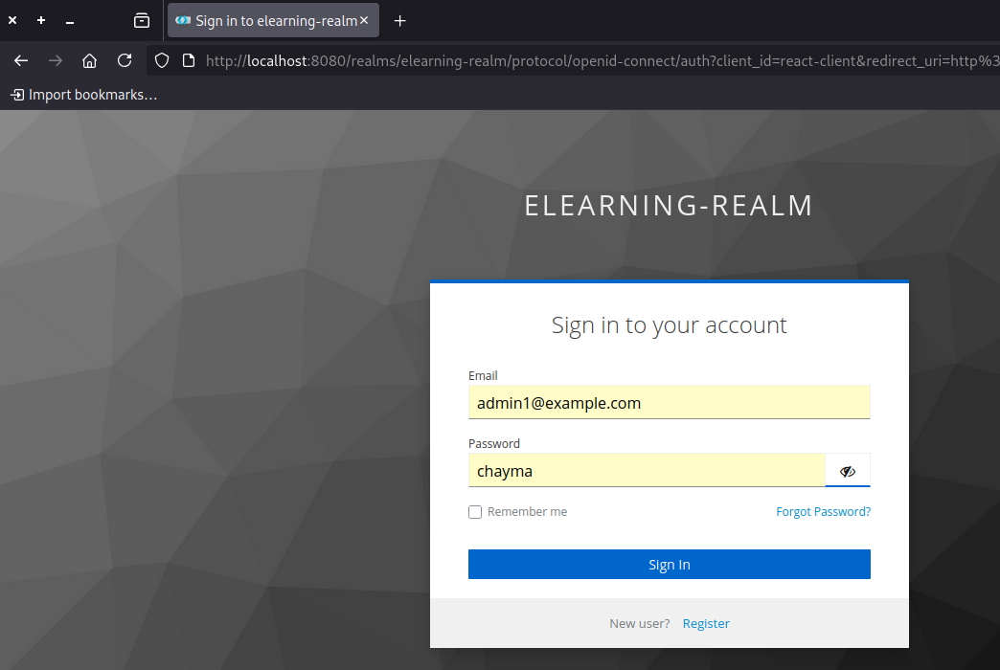
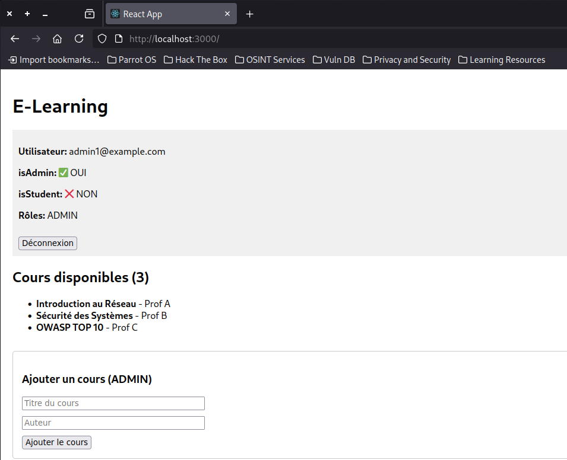
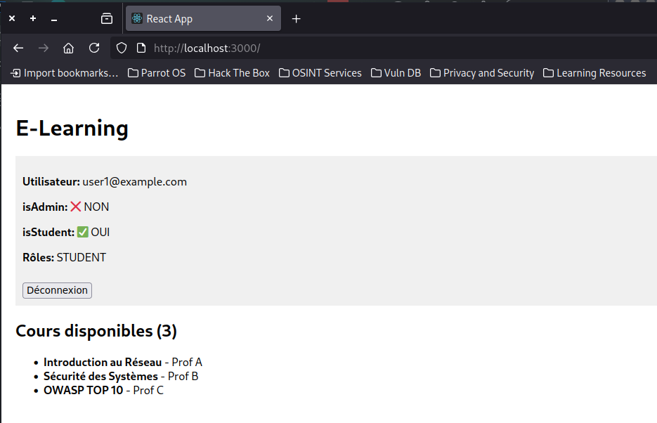

# Application E-Learning Sécurisée (React / Spring Boot / Keycloak)

## 1. Présentation du projet

Cette application e-learning est une application web sécurisée permettant :

* l’authentification et l’autorisation via **Keycloak**
* l’accès aux cours pour les utilisateurs authentifiés
* la gestion des cours réservée aux **administrateurs**

L’architecture repose sur :

* **React** : Frontend
* **Spring Boot** : Backend (API REST)
* **Keycloak** : Serveur d’authentification OAuth2 / OpenID Connect

---

## 2. Schéma d’architecture

---

## 3. Fonctionnalités principales

* Authentification sécurisée avec Keycloak
* Gestion des rôles :

  * `ADMIN`
  * `STUDENT`
* Accès contrôlé aux API :

  * Lecture des cours : utilisateurs connectés
  * Ajout de cours : administrateurs uniquement
* Affichage des rôles et du profil utilisateur dans React

---

## 4. Sécurité

* OAuth2 / OpenID Connect
* JWT signé et vérifié côté Spring Boot
* Protection par :

  * URL (`requestMatchers`)
  * Méthodes (`@PreAuthorize`)
* Gestion CORS et requêtes `OPTIONS`

---

## 5. Captures d’écran (à inclure dans le rapport)

1. Connexion réussie via Keycloak
   
  
  
  

  

2. Informations du profil utilisateur
   
   
   
3. Rôles affichés dans l’interface React

   

   
   
5. Accès autorisé (ADMIN) aux endpoints protégés
   
   
   
   
   
   
---

## 6. Conclusion

Cette application démontre l’intégration complète d’un système d’authentification centralisé avec Keycloak et la mise en œuvre d’un contrôle d’accès robuste entre le frontend et le backend.

---

